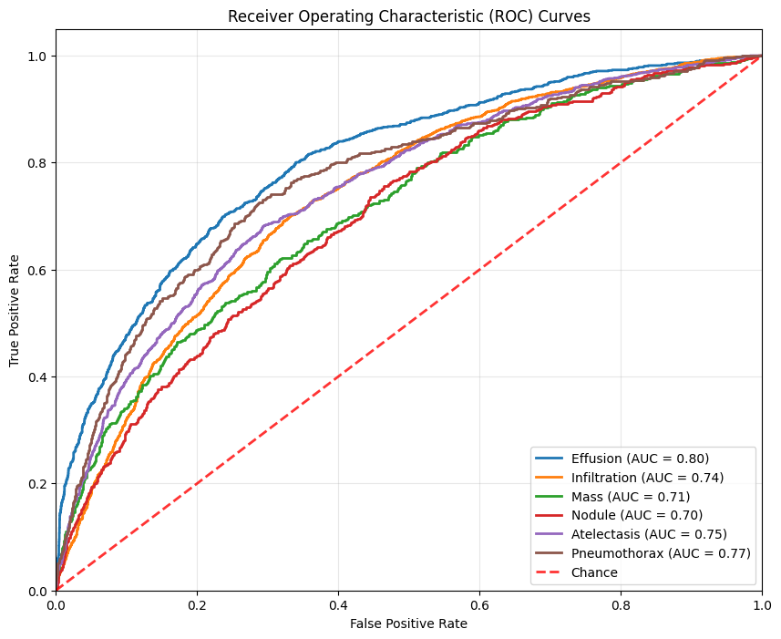

# Chest X-ray Disease Classification using CustomDenseNet121

## Overview

This project focuses on the classification of thoracic diseases using the NIH Chest X-ray Dataset. The dataset comprises 112,120 frontal-view X-ray images from 30,805 distinct patients, annotated with text-mined labels extracted from associated radiological reports using natural language processing techniques. Our goal is to explore machine learning and deep learning methods to accurately classify these diseases.

## Data Source

The dataset is sourced from the clinical Picture Archiving and Communication System (PACS) at the National Institutes of Health Clinical Center. It provides a comprehensive reflection of real patient population distributions and the complexities of clinical diagnosis. The dataset includes 14 common thorax disease categories:

1. Atelectasis
2. Cardiomegaly
3. Effusion
4. Infiltration
5. Mass
6. Nodule
7. Pneumonia
8. Pneumothorax
9. Consolidation
10. Edema
11. Emphysema
12. Fibrosis
13. Pleural Thickening
14. Hernia

- **Data Source**: [NIH Press Release](https://www.nih.gov/news-events/news-releases/nih-clinical-center-provides-one-largest-publicly-available-chest-x-ray-datasets-scientific-community)
- **Kaggle Dataset Link**: [NIH Chest X-rays Dataset on Kaggle](https://www.kaggle.com/datasets/nih-chest-xrays/data)

## Background & Motivation

Chest X-ray examinations are frequent and cost-effective medical imaging procedures. However, clinical diagnosis using chest X-rays can be challenging, sometimes even more so than using chest CT imaging. While promising work has been reported, especially in deep learning applications for Tuberculosis (TB) classification, achieving clinically relevant computer-aided detection and diagnosis (CAD) in real-world medical settings remains difficult. This dataset, significantly larger and more representative than previous ones, aims to address these challenges by facilitating more effective deep neural network training.

## Methodology

### Model Architecture

Developed a custom model, `CustomDenseNet121`, based on the DenseNet121 architecture. This model is designed to handle the complexities of 7 types of common medical image classification.

### Training Process

1. **Data Preprocessing**: Images were resized and normalized to fit the input requirements of the model.
2. **Data Augmentation**: Techniques such as rotation, zoom, and horizontal flipping were applied to enhance the dataset's diversity.
3. **Model Training**: The model was trained using a suitable optimizer and loss function, with early stopping and checkpointing to save the best model based on validation performance.

Training was performed on a GPU to accelerate the computation process, enabling efficient handling of the large dataset and complex model architecture.

### Result


### Code Snippet for Model Training

```python
model = CustomDenseNet121(num_classes=len(all_labels)).to(device)
criterion = nn.BCEWithLogitsLoss()
optimizer = optim.AdamW(model.parameters(), lr=0.003)
scheduler = optim.lr_scheduler.ReduceLROnPlateau(optimizer, mode='min', factor=0.1, patience=5)
```
